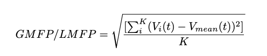

# Global/Local Mean Field Power (GMFP/LMFP)

## Description

Global/Local mean field power (GMFP/LMFP) is often used to measure the global excitability in studies of non-invasive neuromodulation treatments (such as TMS). It can also been applied to analysis other types of ERPs. This document shows how GMFP/LMFP was computed on a given EEG epoch.

The formula of how to calculate GMFP/LMFP is listed as below:

where $t$ is time; $K$ is the number of included EEG channels; $V_{i}$ is the voltage in channel $i$; $V_{mean}$ is the mean of the voltages in all channels. 

Please check on how it's applied and linked to clinic findings in our group's study here: https://www.brainstimjrnl.com/article/S1935-861X(23)00803-3/fulltext

## Table of Contents

- [Installation](#installation)
- [Usage](#usage)
- [Features](#features)
- [License](#license)
- [Credits](#credits)
- [Contact](#contact)

## Installation

No further installation needed. Function files are directly runnable in Matlab and Python. 

## Usage

Provided function file 'gmfp.m' and 'lmfp.m' that calculates the global/local mean field power from given EEG epoch. Corresponding .py file has also been provided.   

## Features

- Feature 1: Two versions have been provided to run in both Matlab and Python. 
- Feature 2: Examples in both enviroment have been provided (see [Link to Documentation] and [Link to Documentation] for details). 

## License

This project is licensed under the [MIT License](https://opensource.org/licenses/MIT). Refer to the [LICENSE](LICENSE) file for more information.

## Credits

This constitutes a segment of our branch's efforts within the closed-loop neuromodulation project. For a more comprehensive background, I encourage you to review our series of publications.

simultaneous fMRI-EEG-TMS: https://www.sciencedirect.com/science/article/pii/S1935861X23017746

phase-locked closed-loop EEG-rTMS: https://www.sciencedirect.com/science/article/pii/S1935861X22000365

Clinic outcomes: https://papers.ssrn.com/sol3/papers.cfm?abstract_id=4334289

## Contact

For any inquiries or questions, you can reach me at [xiaoxiao.sun@columbia.edu]. Connect with me on [LinkedIn](https://www.linkedin.com/in/xiaoxiao-sun-b66012274/) for more updates and projects.

